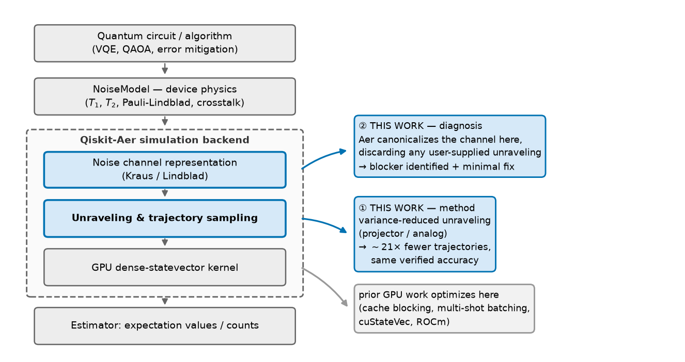
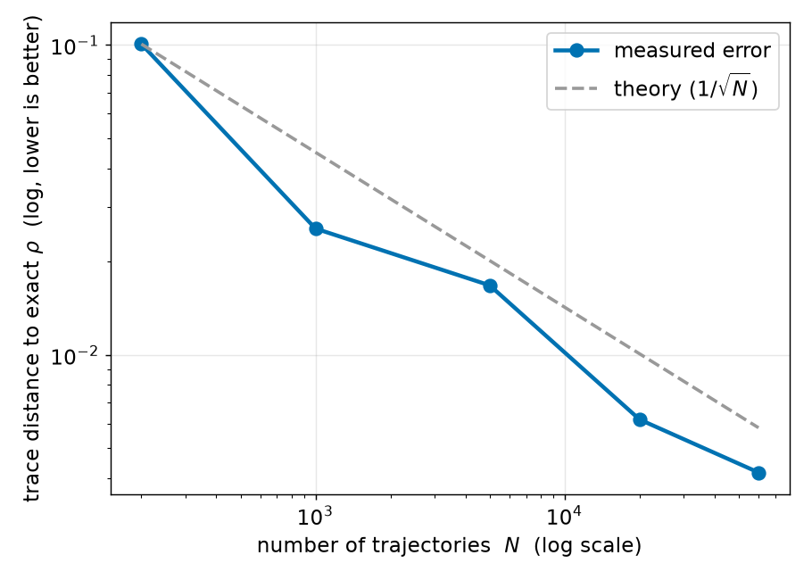
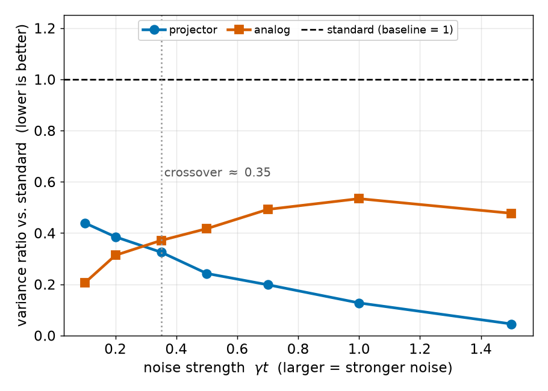
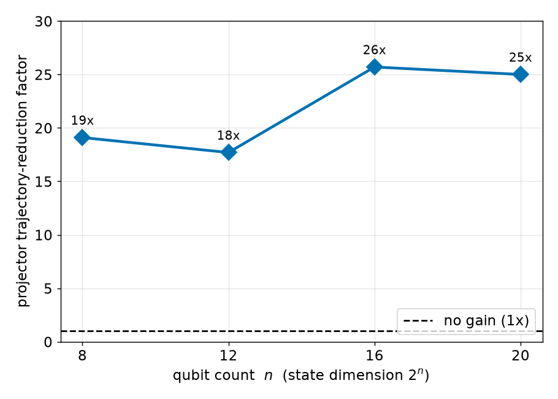
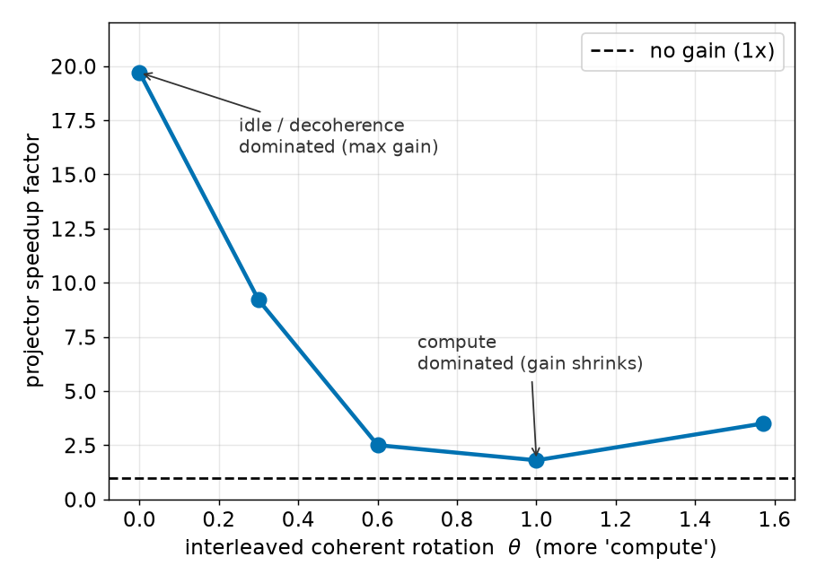
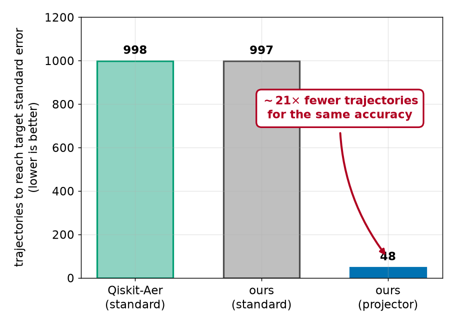

# Variance-Reduced Trajectory Unravelings for GPU Noisy Quantum-Circuit Simulation: Characterization and a Qiskit-Aer Integration Gap

**Chun-Yeol You**
Department of Physics and Chemistry, DGIST, Daegu 42988, Republic of Korea
✉ cyyou@dgist.ac.kr

*Draft for IEEE Transactions on Quantum Engineering (TQE). Markdown mirror of `main.tex`; equations
in LaTeX render in VSCode/GitHub. Figures: `figures/*.png` from `figures/make_figures.py`.*

## Abstract

Monte-Carlo trajectory (quantum-jump) methods are the practical route to simulating noisy quantum
circuits once the exact density-matrix method is precluded by its $4^n$ memory cost ($n\approx14$
qubits on an 8 GB GPU). Their bottleneck is estimator variance: resolving an expectation value can
demand thousands of trajectories—a cost multiplied across the many noisy evaluations required by
variational algorithms and error mitigation. Recent tensor-network work shows that **variance-reduced
unravelings**—projector and analog sampling—sharply cut this variance, but only on CPU
matrix-product-state backends and with no path into production tooling. We implement projector and
analog unravelings on a **GPU dense-statevector** trajectory engine, validate them against the exact
density matrix (ideal-circuit fidelity $1-2.2\times10^{-16}$; $1/\sqrt{N}$ convergence; all
unravelings unbiased to trace distance $<0.01$), and characterize them on a single consumer GPU.
Projector unraveling reaches a target standard error with up to $\sim\!21\times$ fewer trajectories
in the strong-noise regime—$20.8\times$ fewer than Qiskit-Aer's `batched_shots_gpu` at $n=10$—a
factor that holds at $19$–$26\times$ across $n=8$–$20$ and rises to $27\times$ for a GHZ stabilizer
observable. A noise-strength **regime map** places analog optimal at weak noise and projector at
strong noise, crossing near $\gamma t\approx0.35$, and we quantify how coherent dynamics erodes the
advantage ($19.7\times\!\to\!1.8\times$). We further report a systems finding: Qiskit-Aer applies
noise at the **channel** level and reconstructs a canonical Kraus decomposition at apply time,
discarding any user-supplied unraveling, so variance-reduced unravelings cannot be delivered through
its public API today. Because Aer's Born-rule collapse machinery already exists (confirmed via
amplitude damping), we specify a minimal change—preserving the supplied Kraus set and sampling it by
$\lVert K_i\psi\rVert^2$—that would unlock the technique in production.

**Keywords:** Quantum circuit simulation, noise, quantum trajectories, unraveling, variance
reduction, GPU, Qiskit-Aer.

## 1. Introduction

Classical simulation of quantum circuits underpins algorithm development, compiler validation, and
the assessment of error-mitigation strategies in the NISQ era [Preskill 2018]. For *ideal* circuits,
statevector simulators store $2^n$ complex amplitudes and have been pushed to tens of qubits on GPUs
and supercomputers [Häner–Steiger; QuEST; Intel-QS; cuQuantum; Qiskit-Aer]. The far more
demanding—and more practically relevant—task is to simulate circuits *with realistic noise*, since
the noise is precisely what separates a NISQ device from an ideal one and what error-mitigation
methods must model [Temme 2017; van den Berg 2023].

The textbook route to noise evolves the density matrix $\rho$, but its $4^n$ memory footprint caps it
at $n\approx14$ qubits on an 8 GB GPU and $n\approx16$ even on an 80 GB datacenter GPU. The scalable
alternative is the Monte-Carlo trajectory (quantum-jump / MCWF) method [Dalibard 1992; Mølmer 1993;
Plenio–Knight 1998; Breuer–Petruccione; Daley 2014]: the open-system dynamics is *unraveled* into an
ensemble of pure statevector trajectories, and observables are estimated by averaging over them.
Trajectory methods inherit the ideal statevector's $2^n$ memory, so they reach far larger $n$ than
the density matrix; their cost is instead *statistical*, set by the estimator variance. Resolving an
expectation value to a target standard error can require thousands of trajectories, multiplying the
already-large cost of variational and error-mitigation workloads.

A key but underexploited fact is that a given open-system evolution admits *many* unravelings that
reproduce the same $\rho$ while differing greatly in estimator variance. Recent tensor-network work
[TJM, arXiv:2607.01323] makes this concrete, introducing projector and analog unravelings with
provably lower variance for sparse Pauli-Lindblad noise. That work is realized on CPU MPS backends
and is absent from production simulators; related tensor-network noisy-simulation methods [LPDO;
MPDO; Noh 2020] share both properties. Conversely, production GPU simulators [Qiskit-Aer; cuQuantum]
accelerate only the *standard* trajectory unraveling. Variance-reduced unravelings on a GPU dense
statevector—the representation most simulators and hardware vendors optimize—are thus unexplored, and
their path into production tooling is unknown.

**Contributions.** This paper occupies exactly that gap through four connected contributions. First,
we implement projector and analog unravelings on a **GPU dense-statevector** trajectory engine and
validate them against Qiskit-Aer's exact density-matrix method, obtaining ideal-circuit fidelity
$1-\mathcal{O}(10^{-16})$ and $1/\sqrt{N}$ convergence of the reconstructed $\rho$ (§4–5). Building on
that validated engine, we then characterize the variance reduction quantitatively: we measure a
$\sim\!21\times$ reduction in the trajectories needed to reach a target standard error in the
strong-noise regime, show that this factor is stable across $n=8$–$20$, and construct a noise-strength
**regime map** whose analog/projector crossover falls near $\gamma t\approx0.35$ (§6); the same analysis
reveals how the advantage depends on the choice of observable (GHZ stabilizers) and how interleaved
coherent dynamics erodes it. To place these numbers on a production footing, we next benchmark
head-to-head against Qiskit-Aer's `batched_shots_gpu` path, verifying that our standard unraveling is
statistically identical to Aer's—an apples-to-apples control that attributes the gain to the unraveling
rather than to our implementation—while the projector unraveling attains the same accuracy with
$\sim\!21\times$ fewer trajectories (§7). Finally, and unexpectedly, we report and diagnose an
**integration gap**: because Qiskit-Aer applies noise at the channel level and reconstructs a canonical
Kraus decomposition at apply time, it discards any user-supplied unraveling, so variance-reduced
unravelings cannot be delivered through its public API. Since the Born-rule collapse machinery
nevertheless already exists inside Aer, we are able to specify the minimal change that would unlock the
technique in production (§7).

Our framing deliberately avoids a raw-throughput competition with cuStateVec-class kernels or GPU
circuit-partitioning systems [Atlas; quEStab]; the contribution is a statistical technique, its
rigorous GPU characterization, and its precise production-integration path.

## 2. Qiskit, its physical significance, and recent trends



**Fig. 1. Where this work intervenes in the Qiskit-Aer stack.** *Left:* the simulation pipeline. A
quantum circuit and a `NoiseModel` carrying measured device physics ($T_1$, $T_2$, Pauli-Lindblad
rates, crosstalk) are passed to the Qiskit-Aer backend (dashed box), which (i) represents the noise as
a channel (Kraus/Lindblad), (ii) *unravels* that channel into sampled quantum-jump trajectories, and
(iii) evolves each trajectory on a GPU dense-statevector kernel, finally producing expectation values
or counts. *Right:* the two contributions of this paper, both localized to the highlighted blue
stages. **① Method** — we replace the standard Pauli-flip unraveling at the sampling stage with
variance-reduced projector/analog unravelings, obtaining $\sim\!21\times$ fewer trajectories at
identical, independently verified accuracy. **② Diagnosis** — we show that Aer canonicalizes the noise
channel at the representation stage, discarding any user-supplied unraveling, which is precisely why ①
cannot be delivered through the public API today; we identify the minimal change that removes this
blocker. For contrast, essentially all prior GPU work on Aer (cache blocking, multi-shot batching,
cuStateVec, ROCm) optimizes the kernel stage (grey arrow), i.e. the cost *per* trajectory—an axis
orthogonal to, and multiplicative with, the reduction in the *number* of trajectories reported here.

### 2.1 Why Qiskit matters physically

Qiskit [Qiskit-Aer; Javadi-Abhari 2024; Wille 2019] is the de-facto bridge between the *physics of a
real device* and the algorithms run on it. Its `NoiseModel` layer encodes measured device physics—$T_1$
amplitude damping, $T_2$ dephasing, gate-dependent depolarizing rates, readout error, and increasingly
correlated crosstalk expressed as sparse Pauli-Lindblad generators learned from hardware
[van den Berg 2023; Georgopoulos 2021]. Because these are the same Lindbladians that govern the
laboratory system, a Qiskit noisy simulation is effectively a numerical open-quantum-system experiment.
This gives Qiskit a physical role a bare linear-algebra simulator lacks. It serves, first, as a vehicle
for *predictive device modeling*, since comparing simulated with measured observables is how a noise
model—and thus one's physical understanding of the device—is validated [Georgopoulos 2021; Nation 2023].
It serves, second, as a *control experiment for quantum-advantage claims*: classical simulation is the
yardstick against which hardware results are judged, and several "advantage" claims have been narrowed
or overturned by improved classical simulation [Arute 2019; Pan 2022; Markov 2008; Gray 2021]. It
serves, third, as the *engine of error mitigation*, because ZNE and probabilistic error cancellation
[Temme 2017; Kandala 2019; Endo 2021] require accurate noisy expectation values, and the recent
"utility" experiments [Kim 2023] were assessed against precisely such simulations.

Consequently the cost of noisy simulation in Qiskit is not an implementation detail—it directly limits
what device physics can be modeled, and at what scale.

### 2.2 Recent research trends

**(i) Noise-aware NISQ algorithms.** Variational algorithms and their error-mitigated variants
[Cerezo 2021; Bharti 2022; Endo 2021] consume enormous numbers of *noisy expectation-value estimates*,
so the per-estimate statistical cost dominates the budget. **(ii) Classical simulation as a moving
target.** Tensor-network contraction [Markov 2008; Gray 2021; Pan 2022], stabilizer-rank
[Aaronson 2004; Bravyi 2016], and MPS methods [Vidal 2003; Schollwöck 2011; Cirac 2021; Zhou 2020] keep
raising the classical bar. **(iii) Noise as a resource for classical tractability.** Noise limits
entanglement growth, making noisy circuits *easier* to simulate approximately [Noh 2020; Zhou 2020]—the
insight behind MPDO [Verstraete 2004; Zwolak 2004; Cheng 2021; LPDO 2023; MPDO-tomography 2025] and,
most recently, variance-reduced trajectory unravelings [TJM 2026]. **(iv) Hardware acceleration.** GPU
statevector engines [cuQuantum; QuEST; Intel-QS; Häner 2017], cache blocking [Doi 2020], multi-shot
batching [arXiv:2308.03399], ROCm portability [Bi 2024], and multi-GPU partitioning [Atlas; quEStab;
Brown 2025]. Trends (i)+(iii) create the demand our method serves; (iv) supplies the platform; yet
(iii) and (iv) have advanced in separate communities.

### 2.3 Prior Qiskit-related simulation research and what we improve

Work targeting Qiskit-Aer has so far optimized the *cost per amplitude or per shot*: cache blocking
[Doi 2020], GPU multi-shot batching [arXiv:2308.03399], cuStateVec offload [cuQuantum], ROCm portability
[Bi 2024], and device-variability-aware transpilation [Nation 2023]. All accelerate or rearrange the
*same* standard (Pauli-flip) unraveling.

We improve a different, previously untouched axis—the **statistical efficiency of the unraveling
itself**—which multiplies with, rather than competes against, every optimization above. The first
improvement is *fewer trajectories for the same accuracy*: the projector unraveling reduces
trajectories-to-target by $\sim\!21\times$ in the strong-noise regime (§7), at identical, verified
accuracy. The second is *removing an architectural blocker*: we show *why* Qiskit-Aer cannot express
such unravelings today—it canonicalizes the noise channel at apply time—and specify the minimal change
enabling them, reusing collapse machinery Aer already has.

### 2.4 Differentiation of this work

Prior variance-reduction work is CPU/tensor-network and unintegrated; prior GPU work is
production-integrated but statistically standard. **This work is the first to place a variance-reduced
unraveling on a GPU dense statevector, quantify it against a production baseline, and identify the
concrete production-integration path.**

| | variance-reduced | GPU dense statevector | production (Aer) analysis |
|:--|:--:|:--:|:--:|
| Qiskit-Aer | no | yes | is production |
| cuStateVec | no | yes | no |
| Atlas / quEStab | no | yes (ideal) | no |
| MPDO / LPDO | n/a (approx.) | no | no |
| Tensor jump (TJM) | yes | no (MPS/CPU) | no |
| **This work** | **yes** | **yes** | **yes** |

## 3. Background

### 3.1 Open-system dynamics and the MCWF unraveling

A Markovian open-system evolution is generated by a Lindblad master equation
[Lindblad 1976; GKS 1976; Breuer–Petruccione; Nielsen–Chuang]:

$$
\dot\rho = \mathcal{L}(\rho) = \sum_m \gamma_m\!\left(L_m\rho L_m^\dagger - \tfrac12\{L_m^\dagger L_m,\rho\}\right),
$$

with jump operators $L_m$ and rates $\gamma_m\ge0$. For the sparse Pauli-Lindblad model
[van den Berg 2023] the $L_m=P_m$ are Pauli strings ($P_m^\dagger P_m=\mathbb{1}$).

The MCWF method unravels this into pure-state trajectories. Over an interval $\delta t$ with no
coherent Hamiltonian, a trajectory $|\psi\rangle$ evolves under
$H_{\mathrm{eff}}=-\tfrac{i}{2}\sum_m\gamma_m L_m^\dagger L_m$, giving an unnormalized
$|\tilde\psi\rangle=e^{-iH_{\mathrm{eff}}\delta t}|\psi\rangle$ with jump probability

$$
\delta p = 1-\langle\tilde\psi|\tilde\psi\rangle
= 1-\big\langle\psi\big|e^{-\delta t\sum_m\gamma_m L_m^\dagger L_m}\big|\psi\big\rangle .
$$

With probability $1-\delta p$ no jump occurs; otherwise channel $m$ is drawn with
$p_m\propto\gamma_m\lVert L_m|\psi\rangle\rVert^2$ and the state jumps to
$L_m|\psi\rangle/\lVert L_m|\psi\rangle\rVert$. Averaging $|\psi\rangle\langle\psi|$ reproduces
$\rho$ exactly. For Pauli jumps $L_m^\dagger L_m=\mathbb{1}$, so the rate is state-independent,
$\Gamma=\sum_m\gamma_m$ and $\delta p=1-e^{-\Gamma\delta t}$, which we sample *exactly* as a Poisson
process rather than time-stepping.

### 3.2 Unraveling freedom and variance

A generator $\mathcal{L}$ is invariant under $L_m\mapsto\sum_k u_{mk}L_k$ for any isometry $u$.
Different choices reproduce the same $\rho$ (unbiased) but yield estimators with different variance
$\mathrm{Var}[\hat O]=\tfrac1N(\mathbb{E}[\langle O\rangle^2]-\mathbb{E}[\langle O\rangle]^2)$. For a
single dephasing channel $\gamma(Z\rho Z-\rho)$, with $\Pi_\pm=(\mathbb{1}\pm Z)/2$:

$$
\text{standard: } L=\sqrt{\gamma}\,Z;\quad
\text{projector: } L_\pm=\sqrt{2\gamma}\,\Pi_\pm;\quad
\text{analog: } L_\theta=\sqrt{\lambda w(\theta)}\,e^{i\theta Z},\ \lambda\,\mathbb{E}_w[\sin^2\theta]=\gamma.
$$

**Projector reproduces the same generator:** $\sum_\pm L_\pm\rho L_\pm^\dagger=\gamma(\rho+Z\rho Z)$
and $\sum_\pm L_\pm^\dagger L_\pm=2\gamma\mathbb{1}$, so the dissipator equals $\gamma(Z\rho Z-\rho)$,
identical to the standard one—but a jump now *collapses* the state onto a $Z$-eigenspace.

### 3.3 Why the variance differs

Take $O$ with $\{O,Z\}=0$ (e.g. $O=X$), prepared in an $O$-eigenstate ($|+\rangle$), pure dephasing,
no coherent evolution. The exact mean is $\langle O\rangle_t=e^{-2\gamma t}$. Under **standard**
unraveling each jump applies $Z$, flipping $|+\rangle\leftrightarrow|-\rangle$, so
$\langle O\rangle=(-1)^{N(t)}$ with $N(t)\sim\mathrm{Poisson}(\gamma t)$—a $\pm1$ telegraph:

$$
\mathrm{Var}_{\mathrm{std}}=1-e^{-4\gamma t}.
$$

Under **projector** unraveling the first jump collapses onto a $Z$-eigenstate where $\{O,Z\}=0$
forces $\langle O\rangle=0$ forever—an *absorbing window*—so the estimator is Bernoulli:

$$
\mathrm{Var}_{\mathrm{proj}}=e^{-2\gamma t}\left(1-e^{-2\gamma t}\right),
$$

giving $\mathrm{Var}_{\mathrm{proj}}/\mathrm{Var}_{\mathrm{std}}=e^{-2\gamma t}/(1+e^{-2\gamma t})\to0$
in the strong-noise limit. Analog unraveling instead replaces rare large flips with frequent small
kicks and is most effective at weak noise. These are the theoretical anchors reproduced in §6.

## 4. Method: GPU dense-statevector engine

**State and gates.** An $n$-qubit statevector is a rank-$n$ complex tensor on the GPU (cupy), axis
$q$ indexing qubit $q$. A 1-qubit gate $U$ on qubit $q$ contracts along axis $q$
($\psi'_{\ldots i_q\ldots}=\sum_j U_{i_q j}\psi_{\ldots j\ldots}$); a 2-qubit gate contracts along
two axes. Each gate touches all $2^n$ amplitudes once—gate application is memory-bandwidth-bound,
$\mathcal{O}(2^n)$ per trajectory.

**Unraveling ops.** Standard applies $Z_q$ on a jump; projector measures $\langle Z_q\rangle$, forms
$p_\pm=\tfrac12(1\pm\langle Z_q\rangle)$, and collapses
$\psi\leftarrow\tfrac12(\psi\pm Z_q\!\cdot\!\psi)/\lVert\cdot\rVert$; analog applies
$e^{i\theta Z_q}=\cos\theta\,\mathbb{1}+i\sin\theta\,Z_q$. Expectations
$\langle O_q\rangle=\mathrm{Re}\,\psi^\dagger(O_q\!\cdot\!\psi)$ and norms are GPU reductions. For the
GHZ stabilizer, $\langle X^{\otimes n}\rangle=\mathrm{Re}\sum_x\psi_x^*\psi_{\bar x}$ with
$\bar x=x\oplus(2^n-1)$.

**Exact event sampling.** Because rates are state-independent, over an idle window $\tau$ on channel
$q$: standard draws $k\sim\mathrm{Poisson}(\gamma\tau)$ and applies $Z_q^{k}$ (parity); projector
jumps with probability $1-e^{-2\gamma\tau}$ and collapses once; analog draws
$k\sim\mathrm{Poisson}(\lambda\tau)$ signed kicks. The estimator is the sample mean of per-trajectory
expectations, $\hat O=\tfrac1N\sum_i\langle\psi^{(i)}|O|\psi^{(i)}\rangle$, with
$\mathrm{SE}=\sqrt{\mathrm{Var}[\langle O\rangle]/N}$.

```
Algorithm 1 — one trajectory (unraveling ∈ {std, proj, analog})
  ψ ← |0…0⟩
  for each stage in circuit:
      if gate stage:  apply each gate to ψ by contraction
      else (noise window τ):
          for each qubit q with an active channel:
              sample events per the unraveling and update ψ
  return ⟨ψ|O|ψ⟩
```

## 5. Validation

All measurements: single NVIDIA RTX 5060 Ti (8 GB), qiskit 1.2.4, qiskit-aer-gpu 0.15.1, cupy 14.1.1,
fixed seeds.

- **(i) Ideal circuits.** 8-qubit entangling circuit vs `quantum_info.Statevector`: fidelity
  $1-2.2\times10^{-16}$; Aer GPU path $1-4.4\times10^{-16}$ (machine precision).
- **(ii) Convergence to exact ρ.** 6-qubit depolarizing circuit (purity $\mathrm{Tr}\rho^2=0.6143$):
  trace distance to Aer `density_matrix` falls $0.1007\to4.17\times10^{-3}$ for $N=200\to6\times10^4$;
  $D\cdot\sqrt N$ ≈ constant ($1.42,0.81,1.19,0.87,1.02$) — the $1/\sqrt N$ rate (**Fig. 2**).
- **(iii) Unbiasedness.** 8-qubit GHZ + dephasing, $N=1.5\times10^4$: trace distance to exact ρ is
  $0.0093$ (standard), $0.0045$ (projector), $0.0063$ (analog) — all $<0.01$. Variance reduction
  changes the spread, never the mean.



**Fig. 2. Correctness of the GPU trajectory engine.** We reconstruct
$\rho=\frac1N\sum_i|\psi^{(i)}\rangle\langle\psi^{(i)}|$ from $N$ standard-unraveling trajectories and
plot its trace distance to Qiskit-Aer's *exact* `density_matrix` result (log–log). The $x$-axis is the
number of trajectories $N$ ($2\times10^2$ to $6\times10^4$); the $y$-axis is the trace distance (lower
= more accurate). Blue circles are the measured error; the grey dashed line is the theoretical
Monte-Carlo rate $\propto1/\sqrt N$ anchored at the first point. The error falls $0.101\to4.2\times10^{-3}$
and stays on the $1/\sqrt N$ reference throughout ($D\cdot\sqrt N\approx1.0$), so the estimator is
unbiased and converges at the statistically optimal rate—establishing that "fewer trajectories"
(Figs. 3 and 6) is a real efficiency gain, not a loss of accuracy. System: 6-qubit circuit, depolarizing
noise on single-qubit gates, reference purity $\mathrm{Tr}\,\rho^2=0.61$.

## 6. Results: characterization

### 6.1 Closed-form variance reproduction

Single-qubit dephasing ($O=X$, $|+\rangle$), $N=2\times10^4$. Means match $e^{-2\gamma t}$ throughout
($0.0456$ vs. $0.0498$ at $\gamma t=1.5$). Variances match the closed forms: at $\gamma t=1.5$,
standard $0.9979$ (predicted $0.9975$), projector $0.0485$ (predicted $0.0473$) — a $20.6\times$
reduction; at $\gamma t=0.1$ analog attains the lowest variance ($0.069$ vs. standard $0.329$,
projector $0.148$).

### 6.2 Regime map

**Fig. 3** / **Table I** ($n=12$, $N=2\times10^3$). The projector ratio decreases from $0.44$ at
$\gamma t=0.1$ to $0.045$ at $\gamma t=1.5$ ($\sim\!22\times$ reduction); the analog ratio rises from
$0.21$ to $\sim\!0.48$. They cross near $\gamma t\approx0.35$: analog wins below, projector above.

**Table I — Variance ratio vs. standard ($n=12$). Lower is better.**

| $\gamma t$ | proj/std | analog/std | winner |
|---:|---:|---:|:--|
| 0.10 | 0.439 | 0.206 | analog |
| 0.20 | 0.385 | 0.313 | analog |
| 0.35 | 0.325 | 0.371 | ≈ crossover |
| 0.50 | 0.242 | 0.417 | projector |
| 0.70 | 0.198 | 0.492 | projector |
| 1.00 | 0.127 | 0.534 | projector |
| 1.50 | 0.045 | 0.477 | projector |



**Fig. 3. Regime map of unraveling efficiency.** $x$-axis: accumulated noise strength $\gamma t$
(larger = stronger noise). $y$-axis: per-trajectory estimator variance *relative to* the standard
unraveling, so lower is better and the black dashed baseline at 1 is standard. Blue circles =
projector, orange squares = analog (single dephasing channel, $n=12$, $N=2\times10^3$). Both curves
lie entirely below 1, i.e. both beat standard everywhere. The projector ratio falls monotonically to
0.045 at $\gamma t=1.5$ (a $\sim\!22\times$ variance reduction); analog is lowest at weak noise; the
two cross near $\gamma t\approx0.35$ (grey dotted). Practical reading: use analog left of the
crossover, projector right of it—and since deeper/larger noisy circuits accumulate more $\gamma t$,
they fall into the projector-favorable region.

### 6.3 Trajectory savings and scaling

**Table II** / **Fig. 4** (strong noise, $\gamma t=1.5$, target SE ≤ $10^{-2}$). Standard needs
$539$–$1186$ trajectories; projector $22$–$62$, a $19.1\times$–$25.7\times$ speedup, essentially flat.
Statevector memory is $16.8$ MB at $n=20$—four orders below the 8 GB ceiling—so the method is
compute-bound, and the advantage is $n$-independent.

**Table II — Trajectories-to-target (SE ≤ $10^{-2}$, $\gamma t=1.5$).**

| $n$ | dim $2^n$ | $N_\text{std}$ | $N_\text{proj}$ | speedup | SV mem |
|---:|---:|---:|---:|---:|---:|
| 8 | 256 | 1186 | 62 | 19.1× | 4 KB |
| 12 | 4096 | 785 | 44 | 17.7× | 64 KB |
| 16 | 65 536 | 632 | 25 | 25.7× | 1 MB |
| 20 | 1 048 576 | 539 | 22 | 25.0× | 16.8 MB |



**Fig. 4. Scaling of the trajectory-reduction factor.** $x$-axis: qubit count $n$ (state dimension
$2^n$, i.e. 256 to $\sim\!10^6$ amplitudes). $y$-axis: how many times fewer trajectories projector
needs than standard for the same target SE ($\le10^{-2}$, strong noise $\gamma t=1.5$). Each blue
marker is a measured ratio (Table II); the dashed line at 1 is "no advantage". The factor stays in
the 19–26× band with no downward trend, so the benefit is a statistical property of the unraveling,
not a small-system artifact. Statevector memory is only 16.8 MB at $n=20$ (four orders below the 8 GB
budget), so the method is compute-bound here and the same advantage is expected to persist into the
$\sim\!30$-qubit regime reachable on larger-memory GPUs.

### 6.4 Entangled states: observable choice matters

For GHZ, $\langle X_i\rangle\equiv0$; the meaningful quantity is the stabilizer $X^{\otimes n}$
(decays as $e^{-2n\gamma t}$, anticommutes with each $Z_i$). At $n=10$ the projector estimator is
Bernoulli with $\mathrm{Var}_\text{proj}=m(1-m)$: measured means $0.3645,0.1360,0.0380$ track exact
$0.368,0.135,0.050$ at $\gamma t=0.05,0.10,0.15$, and the projector speedup grows
$3.6\times\!\to\!8.4\times\!\to\!27.2\times$ as $n\gamma t$ increases. The earlier "no benefit for
GHZ" was an observable-choice artifact.

### 6.5 Coherent erosion: an applicability map

Interleaving $R_Y(\theta)$ rotations between noise windows ($n=8$, $\gamma t=1.5$) erodes the
absorbing window monotonically: projector speedup falls $19.7\times$ ($\theta=0$) → $9.2\times$
($0.3$) → $2.5\times$ ($0.6$) → $1.8\times$ ($1.0$), rebounding to $3.5\times$ at $\pi/2$ (**Fig. 5**).
The mean stays unbiased throughout. Projector is most powerful in decoherence/idle-dominated regimes.



**Fig. 5. Applicability map: coherent dynamics erodes the advantage.** $x$-axis: angle $\theta$ of
$R_Y(\theta)$ rotations interleaved between noise windows—a proxy for how much coherent "compute" the
circuit does relative to idle decoherence. $y$-axis: projector trajectory-reduction factor ($n=8$,
$\gamma t=1.5$). At $\theta=0$ (pure idle/dephasing, the absorbing-window ideal) the speedup is
largest, 19.7×; it falls monotonically to 1.8× at $\theta=1.0$ as $R_Y$ (which does not commute with
the measured $X$) rotates collapsed states back out of the absorbing subspace, with a partial rebound
to 3.5× at $\pi/2$. The estimator mean stays unbiased at every $\theta$; only the *size* of the
variance advantage changes. Practical message: projector pays off most for decoherence/idle-dominated
workloads (quantum memory, long-delay circuits)—precisely where noisy-simulation cost is otherwise
highest.

## 7. Head-to-head with Qiskit-Aer and the integration gap

### 7.1 Benchmark

**Table III** / **Fig. 6** ($n=10$, $\gamma t=1.5$, exact mean $0.0498$, target SE ≤ $10^{-2}$).
Our standard unraveling has the *same* per-sample spread as Aer ($0.3158$) and needs $997$ vs. Aer's
$998$ trajectories—an apples-to-apples baseline. Projector cuts the std to $0.0695$ and needs $48$
trajectories, $20.8\times$ fewer than Aer. Wall-clock is honest: Aer's C++/CUDA engine is fastest
today ($36.7$ ms), our Python prototype slower; but within our engine projector already beats standard
$199.8$ vs. $1747.6$ ms ($8.7\times$) from the trajectory saving alone.

**Table III — Head-to-head ($n=10$, $\gamma t=1.5$; exact mean $0.0498$).**

| method | mean | per-sample std | $N$-to-target | wall-clock |
|:--|---:|---:|---:|---:|
| Aer `batched_shots` | 0.0497 | 0.3158 | 998 | 36.7 ms |
| ours, standard | 0.0452 | 0.3158 | 997 | 1747.6 ms |
| ours, projector | 0.0499 | 0.0695 | **48** | 199.8 ms |



**Fig. 6. Head-to-head against Qiskit-Aer.** Bar height = number of trajectories (equivalently shots)
to reach target SE $\le10^{-2}$ on $\frac1n\sum_i X_i$; lower is better. Conditions: $n=10$, strong
noise $\gamma t=1.5$, exact mean 0.0498 (all three reproduce it). Left (green): Aer's production
`batched_shots_gpu` standard unraveling, 998. Middle (black): our standard unraveling, 997—
statistically indistinguishable from Aer, certifying our engine as a faithful apples-to-apples
baseline (the gain is from the unraveling, not the implementation). Right (blue): our projector, 48—a
$\sim\!21\times$ reduction at identical accuracy. Wall-clock is discussed in §6: the saving is in
*trajectory count*, an engine-independent statistical quantity a compiled implementation converts to
proportional wall-clock.

### 7.2 Why Aer cannot express this today

We supplied the dephasing channel in the projector Kraus decomposition
$\{\sqrt{1-2p}\,\mathbb{1},\sqrt{2p}\,\Pi_+,\sqrt{2p}\,\Pi_-\}$ (identical CPTP map to the standard
$\{\sqrt{1-p}\,\mathbb{1},\sqrt p\,Z\}$). Aer produced the correct mean but the *standard* variance—no
reduction. Inspection shows Aer stores the error as a single `kraus` instruction and, at apply time,
reconstructs a *canonical* Kraus set from the channel (the Choi eigen-Kraus—for dephasing, the
orthogonal Pauli set), discarding the user's non-canonical decomposition. Aer preserves the channel,
not the unraveling; hence variance-reduced unravelings cannot be delivered through the API.

### 7.3 A minimal integration path

The required machinery already exists: for a genuinely non-unital channel (amplitude damping) Aer's
statevector `kraus` sampler performs proper Born-rule collapse (per-trajectory $\langle Z\rangle$ is
bimodal, 29.6% collapsed). The minimal change: (i) let a `QuantumError` carry a *preserve-unraveling*
flag so the supplied Kraus set survives to apply time, (ii) sample $K_i$ by $\lVert K_i\psi\rVert^2$
over that set rather than the canonical one, and (iii) expose a per-trajectory expectation
accumulator. This localized addition would make variance-reduced unravelings available in production
and realize the $21\times$ saving on Aer's optimized engine.

## 8. Related work

- **Statevector / density-matrix simulators.** qHiPSTER/Intel-QS, QuEST, the 45-qubit SC17 run,
  cuQuantum/cuStateVec, Qiskit-Aer with cache blocking—optimize *throughput* for ideal (and small-$n$
  noisy) simulation. We reduce the *statistical* cost of the trajectory method, orthogonal to kernel
  speed.
- **GPU partitioning / multi-GPU.** Atlas, quEStab, and multi-GPU network studies partition a single
  large statevector across GPUs to scale *ideal* circuits—complementary to our fewer-*trajectories*
  axis and the natural setting for a future multi-GPU extension.
- **Trajectory unravelings / open systems.** MCWF has a long history in quantum optics; exploiting the
  unraveling freedom for variance reduction in circuit simulation is recent. The tensor jump method
  introduces the projector/analog unravelings we adopt, on MPS backends. We port them to a GPU dense
  statevector and analyze production integration.
- **Approximate noisy simulation / error mitigation.** LPDO, MPDO, and noise-induced-entanglement
  bounds trade exactness for compression (CPU/tensor-network, no production GPU path). Zero-noise
  extrapolation and probabilistic error cancellation consume many noisy expectation estimates—the very
  workload our method makes cheaper per estimate.

## 9. Limitations

Three limitations bound the present claims. **(i) Prototype wall-clock.** Our engine is a Python (cupy)
prototype; its absolute wall-clock trails Aer's compiled C++/CUDA engine, so the $21\times$ saving is
demonstrated in *trajectory count* and becomes wall-clock only after a CUDA-kernel or Aer-C++
implementation. **(ii) Scale.** Measurements use a single 8 GB consumer GPU with $n\le20$ swept; larger
$n$ is projected, not yet measured. **(iii) Regime dependence.** The projector advantage is largest for
decoherence/idle-dominated circuits and shrinks when strong coherent dynamics is interleaved (Fig. 5);
the estimator remains unbiased throughout, but the speedup is not universal. We also restrict attention
to Pauli-Lindblad noise, for which jump rates are state-independent; non-Pauli channels require the
general norm-dependent sampling of §3.1.

## 10. Future applications and research directions

### 10.1 Scaling to datacenter GPUs

Because the trajectory reduction is a statistical property, it is hardware-independent; a larger GPU
buys *reach* rather than a larger factor. An 80 GB A100/H100 admits $n\approx32$ statevector
trajectories—a regime where the exact density matrix ($4^n$) is impossible ($n\approx16$)—so the same
$\sim\!21\times$ advantage would apply to 30-qubit noisy circuits. Combined with a compiled kernel
(memory-bandwidth gain of $\sim\!5$–$10\times$ over the consumer GPU used here), the compounded
improvement over a standard-unraveling baseline is expected to be one to two orders of magnitude.

### 10.2 Target applications

The method is most valuable wherever many *noisy expectation values* are needed: (a) variational
algorithms (VQE/QAOA) under realistic device noise [Cerezo 2021; Bharti 2022]; (b) error-mitigation
pipelines—ZNE and probabilistic error cancellation [Temme 2017; Kandala 2019; Endo 2021;
van den Berg 2023]—whose cost is dominated by repeated noisy estimates; (c) device characterization and
noise-model validation, i.e. fitting Lindblad generators to measured data [Georgopoulos 2021;
Nation 2023]; (d) quantum-memory and idle-dominated protocols, which sit exactly in the
projector-favorable regime (Fig. 5); and (e) classical-simulation benchmarks used to assess
quantum-advantage claims [Arute 2019; Pan 2022; Kim 2023].

### 10.3 Algorithmic extensions

Natural next steps: **adaptive unraveling selection**, where the simulator chooses projector, analog, or
standard per channel and per circuit window using the measured crossover (Fig. 3) as a runtime policy;
extension beyond Pauli-Lindblad to amplitude damping and general non-unital channels, where Aer's
Born-rule collapse already applies; **hybrid schemes** combining variance-reduced unravelings with
MPS/MPDO representations [TJM 2026; Verstraete 2004; Cheng 2021; LPDO 2023] so both statistical and
representational cost are reduced simultaneously; and importance-sampling or control-variate estimators
layered on top of the unraveling choice.

### 10.4 Systems directions

Beyond the minimal Aer change of §7.3: multi-GPU partitioning of each trajectory for $n>33$ [Atlas;
quEStab; Brown 2025]; cross-vendor evaluation on AMD ROCm [Bi 2024] to test architectural portability of
the advantage; and integration with cuStateVec [cuQuantum], noting that Aer currently disables
cuStateVec on the batched-shots path—a seam where a variance-reduced, collapse-aware kernel could be
particularly valuable.

## 11. Note on AI-assisted development methodology

The engine, benchmark harness, and reproduction scripts in this work were developed with substantial
assistance from an AI coding agent (Claude Code), following a methodology the author has previously
applied and reported in two scientific-software optimization studies: a CUDA-graph-based optimization of
the micromagnetic simulator MuMax3 [You 2026a], and a systematic large-language-model-assisted
optimization of the LAMMPS molecular-dynamics simulator [You 2026b]. In all three cases the productive
pattern was the same: the AI agent is directed to (i) **measure first**, establishing a correctness
oracle and a reproducible benchmark before any optimization; (ii) attack a **specific,
hypothesis-driven** bottleneck rather than performing undirected refactoring; and (iii) **report negative
results faithfully**—in this work, the finding that the projector unraveling *cannot* be injected
through Qiskit-Aer's public API (§7.2) emerged from such an attempt and became a central contribution.
We record this both for transparency and because the cross-domain reuse of a GPU-optimization
methodology (micromagnetics → molecular dynamics → quantum-circuit simulation) is itself a transferable
result. All quantitative claims reported here were verified by executing the accompanying scripts; no
performance number is AI-generated.

## 12. Conclusion

Variance-reduced trajectory unravelings, previously demonstrated only on CPU tensor networks, provide
a $\sim\!21\times$ reduction in trajectory count for GPU dense-statevector noisy simulation, with a
clean noise-strength regime map and unbiased estimates validated against the exact density matrix. We
further show that production Qiskit-Aer cannot express these unravelings because it canonicalizes noise
channels at apply time, and we specify the minimal change that would unlock the technique. The result
is a statistically grounded, production-relevant path to cheaper noisy quantum-circuit simulation.

## Acknowledgment

This work was supported by the National Research Foundation of Korea (NRF)
(No. RS-2025-25463492) and the Strategic Research Program under the DGIST R&D Program
(26-SR-01) of the Ministry of Science, ICT, and Future Planning.

**Disclosure of AI usage.** In accordance with IEEE policy, the author discloses that an AI
coding assistant, Claude Code (Anthropic), was used under the author's direction to implement the
simulation and analysis scripts, execute the benchmark runs, and draft expository text. It did not
originate the research question, hypotheses, interpretation, or conclusions, and is not an author.
All reported numbers were produced by executing the accompanying scripts and were verified by the
author, who takes full responsibility for the manuscript. The underlying methodology is described
in §11 and in [You 2026a; You 2026b].

**Data and code availability.** Reproduction scripts, raw measurement data, environment manifests, and
figure-generation code accompany this manuscript as supplementary material and are available at
<https://github.com/mirryou-maker/qiskit-variance-reduced-unraveling>.

## Conflict of Interest

The author declares no competing financial or non-financial interests.

In particular, the author has no financial or personal relationship with, and receives no support,
funding, or benefit of any kind from, Anthropic or any other vendor of the AI coding assistant
disclosed in the Acknowledgment; no such vendor had any role in the design, execution, analysis, or
reporting of this work, and none reviewed the manuscript prior to submission. Likewise, the author has
no affiliation with, or financial interest in, IBM, the Qiskit project, NVIDIA, or any other
organization whose software or hardware is evaluated here.

The funding bodies named in the Acknowledgment had no role in the design of the study; in the
collection, analysis, or interpretation of the data; in the writing of the manuscript; or in the
decision to submit it for publication.

## References

This Markdown mirror uses author–year tags inline; the `.tex` version carries the corresponding
`\cite` keys (given in brackets). All 50 entries are defined in `references.bib`.

1. J. Preskill, "Quantum Computing in the NISQ era and beyond," *Quantum* **2**, 79 (2018). `[preskill2018]`
2. M. A. Nielsen and I. L. Chuang, *Quantum Computation and Quantum Information*, 10th anniv. ed., Cambridge Univ. Press (2010). `[nielsen_chuang]`
3. G. Lindblad, "On the generators of quantum dynamical semigroups," *Commun. Math. Phys.* **48**, 119 (1976). `[lindblad1976]`
4. V. Gorini, A. Kossakowski, and E. C. G. Sudarshan, "Completely positive dynamical semigroups of N-level systems," *J. Math. Phys.* **17**, 821 (1976). `[gks1976]`
5. H.-P. Breuer and F. Petruccione, *The Theory of Open Quantum Systems*, Oxford Univ. Press (2002). `[breuer_petruccione]`
6. J. Dalibard, Y. Castin, and K. Mølmer, "Wave-function approach to dissipative processes in quantum optics," *Phys. Rev. Lett.* **68**, 580 (1992). `[dalibard1992]`
7. K. Mølmer, Y. Castin, and J. Dalibard, "Monte Carlo wave-function method in quantum optics," *J. Opt. Soc. Am. B* **10**, 524 (1993). `[molmer1993]`
8. M. B. Plenio and P. L. Knight, "The quantum-jump approach to dissipative dynamics in quantum optics," *Rev. Mod. Phys.* **70**, 101 (1998). `[plenio1998]`
9. A. J. Daley, "Quantum trajectories and open many-body quantum systems," *Adv. Phys.* **63**, 77 (2014). `[daley2014]`
10. Authors of arXiv:2607.01323, "Noisy quantum circuit simulation with the tensor jump method," arXiv:2607.01323 (2026). `[tjm2026]`
11. E. van den Berg, Z. K. Minev, A. Kandala, and K. Temme, "Probabilistic error cancellation with sparse Pauli-Lindblad models on noisy quantum processors," *Nat. Phys.* **19**, 1116 (2023). `[sparse_pauli_lindblad2023]`
12. K. Temme, S. Bravyi, and J. M. Gambetta, "Error mitigation for short-depth quantum circuits," *Phys. Rev. Lett.* **119**, 180509 (2017). `[temme2017]`
13. Authors of arXiv:2312.02854, "Locally purified density operators for noisy quantum circuits," arXiv:2312.02854 (2023). `[lpdo2023]`
14. S. Cheng *et al.*, "Simulating noisy quantum circuits with matrix product density operators," *Phys. Rev. Research* **3**, 023005 (2021). `[mpdo_prr]`
15. "Tomography-assisted noisy quantum circuit simulator using matrix product density operators," *Phys. Rev. A* **110**, 032604 (2024). doi:10.1103/PhysRevA.110.032604 `[mpdo_tomography2025]`
16. K. Noh, L. Jiang, and B. Fefferman, "Efficient classical simulation of noisy random quantum circuits in one dimension," *Quantum* **4**, 318 (2020). `[noh2020]`
17. Y. Zhou, E. M. Stoudenmire, and X. Waintal, "What limits the simulation of quantum computers?," *Phys. Rev. X* **10**, 041038 (2020). `[zhou2020]`
18. G. Vidal, "Efficient classical simulation of slightly entangled quantum computations," *Phys. Rev. Lett.* **91**, 147902 (2003). `[vidal2003]`
19. J. I. Cirac, D. Pérez-García, N. Schuch, and F. Verstraete, "Matrix product states and projected entangled pair states: Concepts, symmetries, theorems," *Rev. Mod. Phys.* **93**, 045003 (2021). `[cirac2021mps]`
20. M. Xu *et al.*, "Atlas: Hierarchical partitioning for quantum circuit simulation on GPUs," in *Proc. SC* (2024). `[atlas_sc24]`
21. quEStab authors, "quEStab: Towards scalable quantum circuit simulation on multi-GPU using an extended stabilizer formalism," in *Proc. ACM ICS* (2025). `[questab_ics25]`
22. Brown *et al.*, "Multi-GPU quantum circuit simulation and the impact of network performance," arXiv:2511.14664 (2025). `[multigpu_network2025]`
23. Qiskit contributors, "Qiskit Aer: A high performance simulator for quantum circuits" (2024). `[qiskit_aer]`
24. H. Bayraktar *et al.*, "cuQuantum SDK: A high-performance library for accelerating quantum science," in *Proc. IEEE QCE* (2023). `[cuquantum2023]`
25. T. Jones, A. Brown, I. Bush, and S. C. Benjamin, "QuEST and high performance simulation of quantum computers," *Sci. Rep.* **9**, 10736 (2019). `[quest2019]`
26. T. Häner and D. S. Steiger, "0.5 petabyte simulation of a 45-qubit quantum circuit," in *Proc. SC* (2017). `[haner2017]`
27. G. G. Guerreschi, J. Hogaboam, F. Baruffa, and N. P. D. Sawaya, "Intel Quantum Simulator: a cloud-ready high-performance simulator of quantum circuits," *Quantum Sci. Technol.* **5**, 034007 (2020). `[intelqs2020]`
28. J. Doi and H. Horii, "Cache blocking technique to large scale quantum computing simulation on supercomputers," in *Proc. IEEE QCE* (2020). `[cacheblocking2020]`
29. Authors of arXiv:2308.03399, "Efficient techniques to GPU accelerations of multi-shot quantum computing simulations," arXiv:2308.03399 (2023). `[efficient_multishot2023]`
30. Y. Bi, S. Xu, and Y. Ma, "Running Qiskit on ROCm platform," *EPJ Web Conf.* **295**, 11022 (2024). `[rocm_qiskit2024]`
31. **C.-Y. You, "Optimization of MuMax3 by Using Claude Code: A CUDA-Graph-Based Case Study in AI-Assisted Performance Engineering," *Journal of Magnetics* 31(2), 204–213 (2026). doi:10.4283/JMAG.2026.31.2.204** `[you2026mumax]` — cited as **[You 2026a]**
32. **C.-Y. You, "AI-Assisted Systematic Optimization of the LAMMPS Molecular Dynamics Simulator via Large Language Models" (2026), under review.** `[you2026lammps]` — cited as **[You 2026b]**
33. A. Javadi-Abhari *et al.*, "Quantum computing with Qiskit," arXiv:2405.08810 (2024). `[qiskit2024]`
34. R. Wille, R. Van Meter, and Y. Naveh, "IBM's Qiskit tool chain: Working with and developing for real quantum computers," in *Proc. DATE*, 1234–1240 (2019). `[wille2019qiskit]`
35. K. Bharti *et al.*, "Noisy intermediate-scale quantum algorithms," *Rev. Mod. Phys.* **94**, 015004 (2022). `[bharti2022nisq]`
36. M. Cerezo *et al.*, "Variational quantum algorithms," *Nat. Rev. Phys.* **3**, 625–644 (2021). `[cerezo2021vqa]`
37. S. Endo, Z. Cai, S. C. Benjamin, and X. Yuan, "Hybrid quantum-classical algorithms and quantum error mitigation," *J. Phys. Soc. Jpn.* **90**, 032001 (2021). `[endo2021mitigation]`
38. A. Kandala *et al.*, "Error mitigation extends the computational reach of a noisy quantum processor," *Nature* **567**, 491–495 (2019). `[kandala2019mitigation]`
39. Y. Kim *et al.*, "Evidence for the utility of quantum computing before fault tolerance," *Nature* **618**, 500–505 (2023). `[kim2023utility]`
40. F. Arute *et al.*, "Quantum supremacy using a programmable superconducting processor," *Nature* **574**, 505–510 (2019). `[arute2019supremacy]`
41. F. Pan, K. Chen, and P. Zhang, "Solving the sampling problem of the Sycamore quantum circuits," *Phys. Rev. Lett.* **129**, 090502 (2022). `[pan2022sycamore]`
42. I. L. Markov and Y. Shi, "Simulating quantum computation by contracting tensor networks," *SIAM J. Comput.* **38**, 963–981 (2008). `[markov2008tensor]`
43. J. Gray and S. Kourtis, "Hyper-optimized tensor network contraction," *Quantum* **5**, 410 (2021). `[gray2021hyper]`
44. S. Aaronson and D. Gottesman, "Improved simulation of stabilizer circuits," *Phys. Rev. A* **70**, 052328 (2004). `[aaronson2004stabilizer]`
45. S. Bravyi and D. Gosset, "Improved classical simulation of quantum circuits dominated by Clifford gates," *Phys. Rev. Lett.* **116**, 250501 (2016). `[bravyi2016clifford]`
46. F. Verstraete, J. J. García-Ripoll, and J. I. Cirac, "Matrix product density operators: Simulation of finite-temperature and dissipative systems," *Phys. Rev. Lett.* **93**, 207204 (2004). `[verstraete2004mpdo]`
47. M. Zwolak and G. Vidal, "Mixed-state dynamics in one-dimensional quantum lattice systems," *Phys. Rev. Lett.* **93**, 207205 (2004). `[zwolak2004mixed]`
48. U. Schollwöck, "The density-matrix renormalization group in the age of matrix product states," *Ann. Phys.* **326**, 96–192 (2011). `[schollwock2011dmrg]`
49. P. D. Nation and M. Treinish, "Suppressing quantum circuit errors due to system variability," *PRX Quantum* **4**, 010327 (2023). `[nation2023suppressing]`
50. K. Georgopoulos, C. Emary, and P. Zuliani, "Modeling and simulating the noisy behavior of near-term quantum computers," *Phys. Rev. A* **104**, 062432 (2021). `[georgopoulos2021modeling]`

*Reproduction: raw data in `bench/results/*.csv`; figures via `paper/figures/make_figures.py`;
engine in `src/trajectory/gpu_trajectory.py`; validation in `validation/`.*
